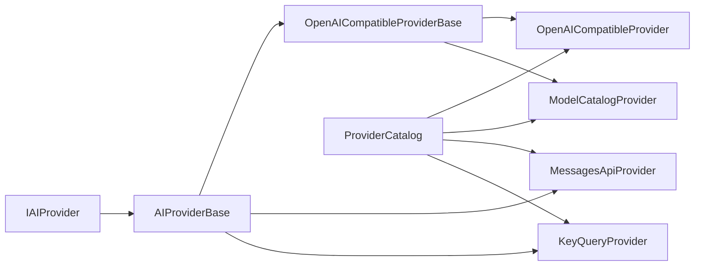

# AIProviderConnect Developer Manual

One .NET interface for talking to AI providers — chat, streaming, tool
calling, and runtime model discovery behind a single `IAIProvider`.

AIProviderConnect ships a catalog of 35+ provider definitions (embedded JSON)
and a small set of protocol-driven provider implementations. You configure a
provider by ID, and the library speaks the right wire protocol for you.

## Feature Overview

| Capability | Entry point | Description |
| --- | --- | --- |
| Chat completions | `IAIProvider.ChatAsync` | Single request/response chat over any registered provider |
| Streaming | `IStreamingChatProvider.StreamAsync` | Server-sent events as `IAsyncEnumerable<StreamingChatChunk>` |
| Tool calling | `ChatCompletionRequest.Tools` | Function definitions in, `ToolCall` list out |
| Model discovery | `IModelDiscoveryProvider.GetModelsAsync` | List models available from a provider at runtime |
| Provider catalog | `ProviderCatalog` | 35+ embedded JSON provider definitions with metadata |
| Dependency injection | `AddAiProviders()` | One-line registration of every catalog provider |

## Architecture at a Glance

All runtime work goes through `IAIProvider`; metadata comes from the catalog.
Five concrete providers cover every wire protocol in the catalog:

Every failure surfaces as an `AiException` with a stable error code — see
[Error Handling](concepts/error-handling.md).

## Where to Start

- New to the library? Follow [Installation](getting-started/installation.md)
  and the [Quick Start](getting-started/quick-start.md).
- Wondering how providers are wired up? Read
  [Wire Protocols](concepts/wire-protocols.md) and
  [Dependency Injection](getting-started/dependency-injection.md).
- Looking for a specific type? Check the
  [API Reference](api-reference/interfaces.md).

## License

MIT — see the `LICENSE.txt` in the repository.
